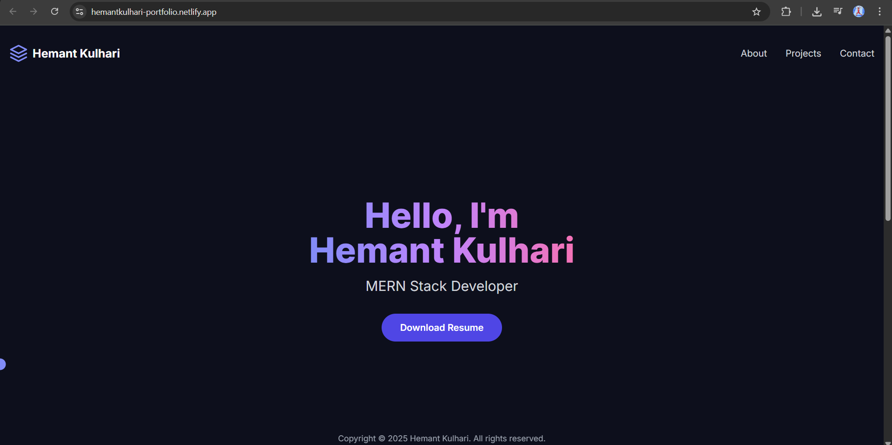
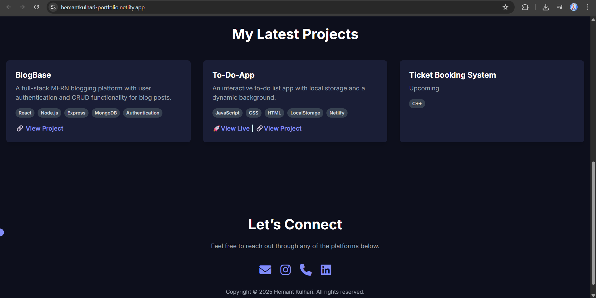

# Hi, I’m Hemant 👋

**MERN-stack developer | React | Node.js | MongoDB | Express**

## 🔭 About me
- 👨‍💻 Currently working on: MERN-stack Hotel Booking Website, along with authentication(Clerk) and payment gateway(Stripe)
- 🌱 Learning: Data Structures and Algorithms
- ⚡ Fun: Coffee and short code experiments

## 🛠 Tech stack

## 🚀 Selected projects
### [Portfolio Website](https://hemantkulhari-portfolio.netlify.app/)  
Personal portfolio showcasing my projects, skills, and experience.  

  
  

### [To-Do App](https://github.com/hemantkulhari1/To-Do-App)  
A simple but polished to-do app with local storage & clean UI.  

### [BlogBase](https://github.com/hemantkulhari1/BlogBase)  
Static blog with markdown support and responsive layout.

  
  
  
  

## 📫 Contact
- Email: hemantkulhari4447@gmail.com
- Portfolio: https://hemantkulhari-portfolio.netlify.app/

## 📊 GitHub Stats

